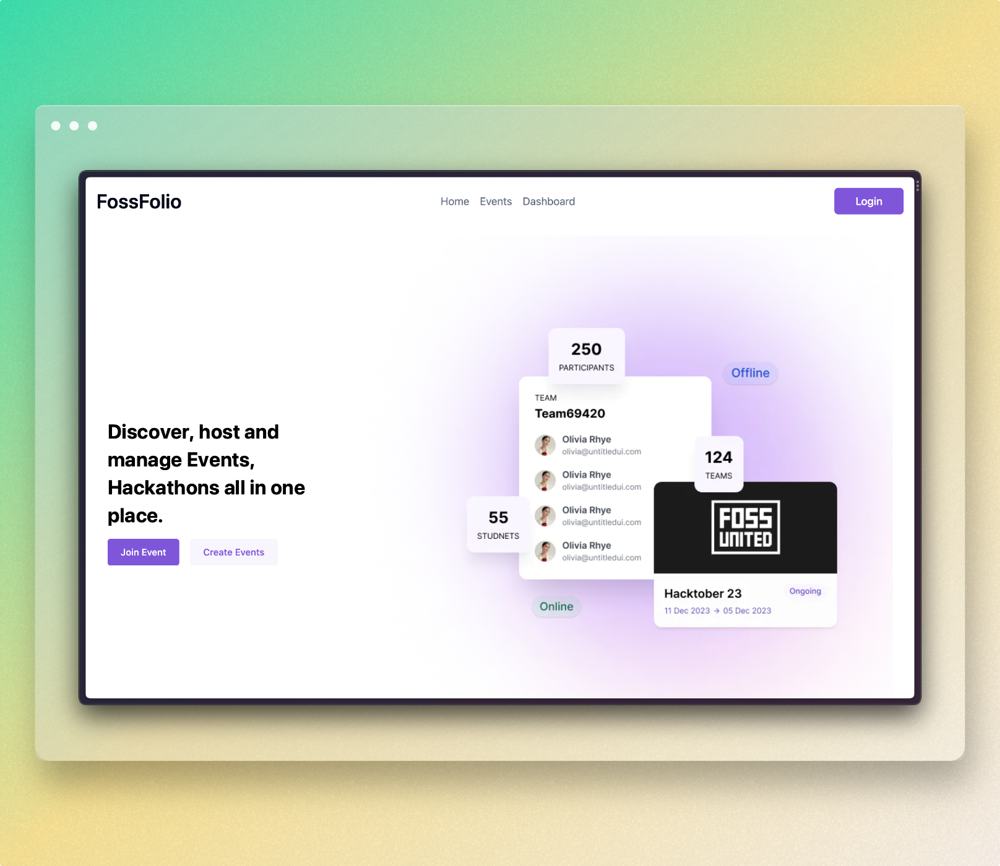
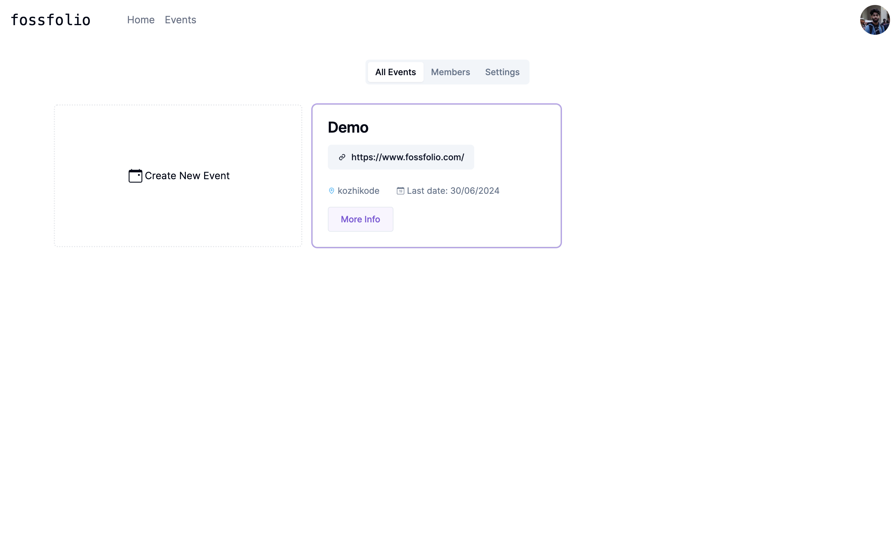
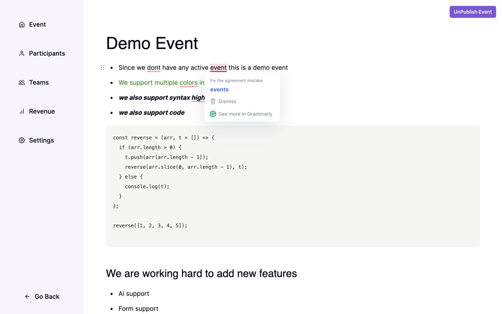
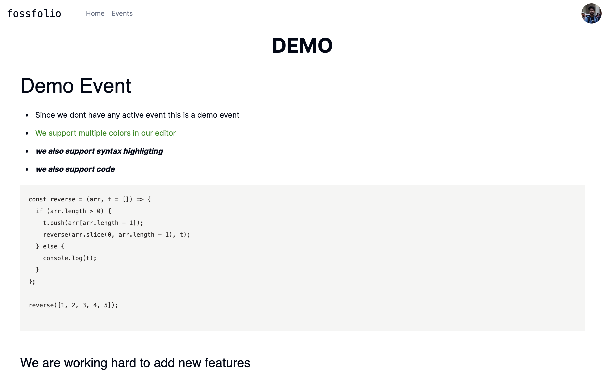
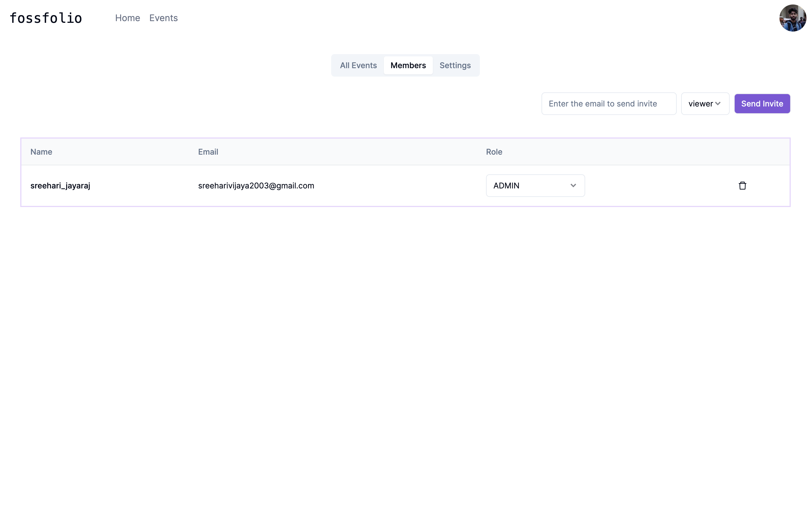
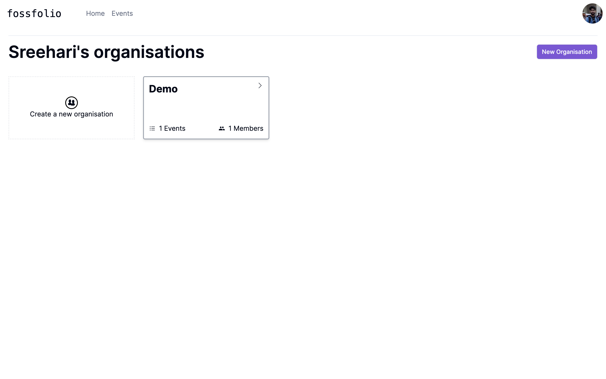
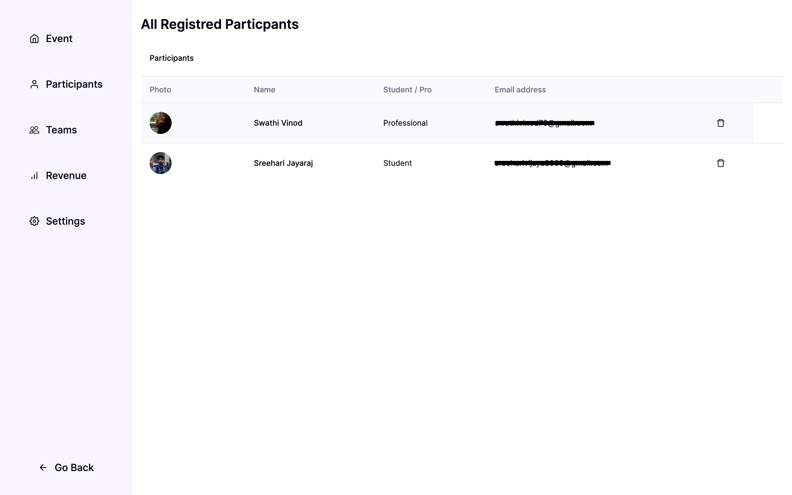
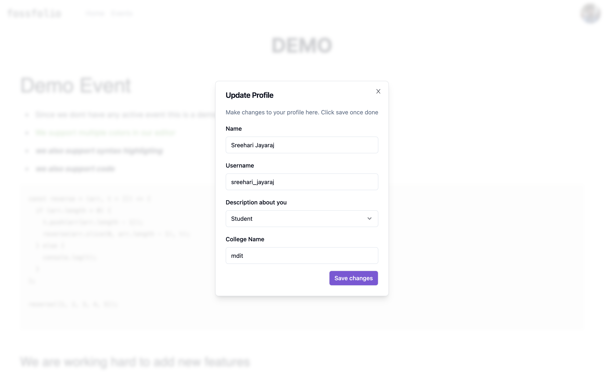
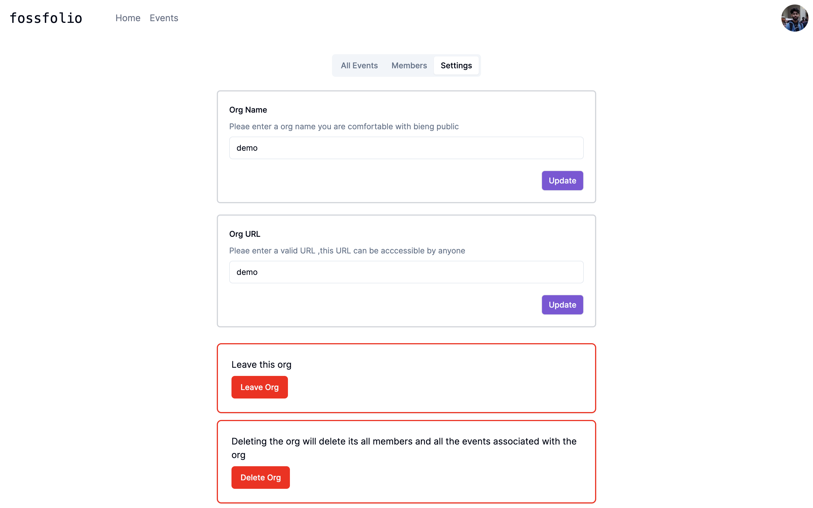

[![Contributors][contributors-shield]][contributors-url]
[![Forks][forks-shield]][forks-url]
[![Stargazers][stars-shield]][stars-url]
[![Issues][issues-shield]][issues-url]
[![MIT License][license-shield]][license-url]

<!-- PROJECT LOGO -->
<br/>



<!-- ABOUT THE PROJECT -->

## About The Project

FossFolio is an open source web application for people to Find, Host and Manage Hackathons.

<!-- TABLE OF CONTENTS -->
<br/>
<details>
  <summary>Table of Contents</summary>
  <ol>
    <li>
      <a href="#about-the-project">About The Project</a>
      <ul>
        <li><a href="#built-with">Built With</a></li>
      </ul>
    </li>
    <li>
      <a href="#getting-started">Getting Started</a>
      <ul>
        <li><a href="#prerequisites">Prerequisites</a></li>
        <li><a href="#installation">Installation</a></li>
      </ul>
    </li>
  </ol>
</details>


## How to run locally

### Install pnpm globally

```bash
npm i -g pnpm
```

### Install all local dependencies

```bash
pnpm install
```

### Install docker and run 

```bash
docker compose up
```
### Migrate prisma and seed the db

```bash
pnpm --filter api prisma migrate dev
pnpm --filter api db:seed
```
### Run client and server

```bash
pnpm --filter web dev

pnpm --filter api nest:dev
```


# Website Pages Showcase

<!-- First Row -->
<div align="start">
  
  
  
  
  
  
  
  
</div>


<p align="right">(<a href="#top">back to top</a>)</p>


<video src='./packages//media//demo.mov' width="180"/>

### Built With

-   [React Js](https://reactjs.org/)
-   [Next Js](https://nextjs.org/)
-   [Nest Js](https://nestjs.com/)
-   [Typescript](https://typescript.org/)

<p align="right">(<a href="#top">back to top</a>)</p>

<!-- GETTING STARTED -->

## Getting Started

### Prerequisites

You need to install

1. [Node v16](https://nodejs.org/en/)
2. [pnpm](https://pnpm.io/)

### Installation

1. Clone the repo

    ```sh
    git clone https://github.com/DarkPhoenix2704/fossfolio.git
    ```

2. Install all the NPM packages all the applications.

    > We are using Yarn workspace and turborepo to manage the applications in monorepo.

    ```sh
    pnpm install
    ```

3. Copy the `.env.example` for each applications to `.env` in the same directory and fill the values required

4. Start the web application dev server and open `http://localhost:3000`

    ```sh
    pnpm web dev
    ```

5. Start the api server at `http://localhost:3001` and prisma studio at `http://localhost:5555`

    ```sh
    pnpm api dev
    ```

6. Start the database `http://localhost:5432`

    ```sh
    docker compose up
    ```

<p align="right">(<a href="#top">back to top</a>)</p>

## Contributing

Contributions are what make the open source community such an amazing place to learn, inspire, and create. Any contributions you make are **greatly appreciated**.

If you have a suggestion that would make this better, please fork the repo and create a pull request. You can also simply open an issue with the tag "enhancement".
Don't forget to give the project a star! Thanks again!

1. Fork the Project
2. Create your Feature Branch (`git checkout -b feature/AmazingFeature`)
3. Commit your Changes (`git commit -m 'Add some AmazingFeature'`)
4. Push to the Branch (`git push origin feature/AmazingFeature`)
5. Open a Pull Request

<p align="right">(<a href="#top">back to top</a>)</p>

[contributors-shield]: https://img.shields.io/github/contributors/DarkPhoenix2704/fossfolio.svg?style=for-the-badge
[contributors-url]: https://github.com/graphs/contributorsDarkPhoenix2704/fossfolio
[forks-shield]: https://img.shields.io/github/forks/DarkPhoenix2704/fossfolio.svg?style=for-the-badge
[forks-url]: https://github.com/network/members/DarkPhoenix2704/fossfolio/network/members
[stars-shield]: https://img.shields.io/github/stars/DarkPhoenix2704/fossfolio.svg?style=for-the-badge
[stars-url]: https://github.com/DarkPhoenix2704/fossfolio/stargazers
[issues-shield]: https://img.shields.io/github/issues/DarkPhoenix2704/fossfolio.svg?style=for-the-badge
[issues-url]: https://github.com/DarkPhoenix2704/fossfolio/issues
[license-shield]: https://img.shields.io/github/license/DarkPhoenix2704/fossfolio.svg?style=for-the-badge
[license-url]: https://github.com/DarkPhoenix2704/fossfolio/blob/main/LICENCE
